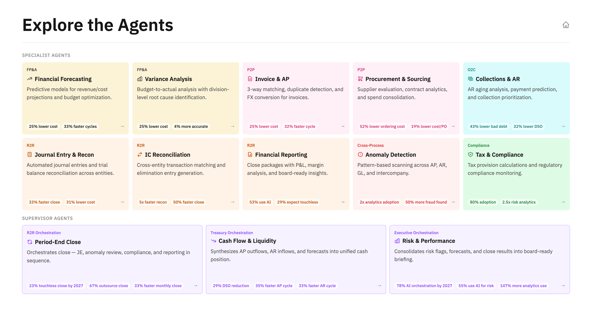

# Agentic AI Finance — Meridian Industries Demo

Landing page + 13 interactive demo pages, each with a live Watson Orchestrate chat widget connected to an AI agent.

**Scenario:** Meridian Industries — $4.8B industrial manufacturer, 6 global entities, SAP S/4HANA ERP. November month-end close.

## The 13 Agents

10 specialists + 3 supervisors. Supervisors orchestrate specialists to complete end-to-end workflows.

| Agent | Category | What It Does |
|-------|----------|--------------|
| Financial Forecasting | FP&A | Revises forecasts when commodity prices or demand shift — builds base/downside/upside scenarios for the board |
| Variance Analysis | FP&A | Decomposes budget-to-actual gaps into price, volume, and mix — separates timing shifts from structural misses |
| Invoice & AP Processing | P2P | Runs 3-way matching, blocks duplicates, splits FX from real price variances, routes exceptions |
| Procurement & Sourcing | P2P | Evaluates contracts against market moves, identifies alternate suppliers, generates PO schedules |
| Collections & Receivables | O2C | Scores receivables by payment risk, predicts payment dates, models DSO impact of collection actions |
| Journal Entry & Reconciliation | R2R | Triages journal entries across all entities — confirms recurring, validates non-recurring, flags anomalies |
| Intercompany Reconciliation | R2R | Auto-matches IC transactions, resolves FX and timing differences, generates elimination entries |
| Anomaly Detection | Cross-cutting | Scans all transactions for duplicates, control violations, and vendor red flags with confidence scoring |
| Tax & Compliance | Cross-cutting | Calculates provisions across jurisdictions, validates transfer pricing, tracks incentive renewals and filing deadlines |
| Financial Reporting | R2R | Compiles consolidated statements, variance commentary, and board summaries from close data |
| **Period-End Close** (supervisor) | R2R | Orchestrates 5 specialists through the close sequence with gate checks and escalation routing |
| **Cash Flow & Liquidity** (supervisor) | FP&A | Aggregates inflows, outflows, and commitments from 4 specialists into a 90-day rolling cash forecast |
| **Risk & Performance** (supervisor) | FP&A | Consolidates risk signals from 5 specialists into a board-ready dashboard ranked by financial impact |

### How Supervisors Orchestrate

**Period-End Close** drives the monthly close — reconciles journals, eliminates intercompany, runs anomaly gate checks, books tax provisions, and produces the close package.

**Cash Flow & Liquidity** builds the cash position — pulls forecasts, committed POs, expected inflows, and outflows into a unified liquidity view.

**Risk & Performance** surfaces enterprise risk — aggregates anomalies, forward exposure, budget-to-actual gaps, regulatory signals, and consolidates into a risk dashboard.
